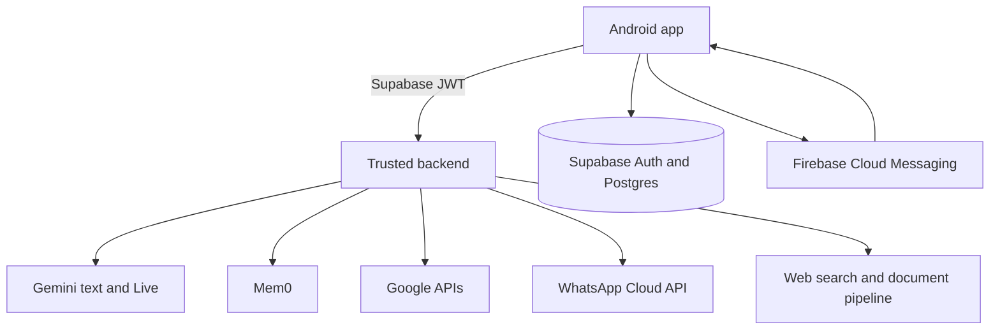

# HOPE AI V2.0 Architecture

## Runtime flow



## Android modules

Use a single app module initially with strict packages so it can be modularized
later without a rewrite.

```text
com.yashpawar.hopeai
├── app
├── auth
├── core
│   ├── common
│   ├── network
│   ├── security
│   ├── database
│   ├── notifications
│   └── ui
├── data
│   ├── supabase
│   ├── memory
│   ├── chat
│   ├── voice
│   └── integrations
├── domain
│   ├── model
│   ├── repository
│   └── usecase
├── feature
│   ├── onboarding
│   ├── home
│   ├── chat
│   ├── voice
│   ├── memory
│   ├── tasks
│   ├── calendar
│   ├── documents
│   ├── integrations
│   └── settings
└── service
```

## Supabase tables

Every user-owned table includes `user_id uuid not null references auth.users`
and Row Level Security.

- `profiles`
- `user_preferences`
- `devices`
- `conversations`
- `messages`
- `memory_records`
- `memory_events`
- `tasks`
- `reminders`
- `notification_deliveries`
- `documents`
- `document_chunks`
- `integration_connections`
- `oauth_states`
- `subscriptions`
- `usage_counters`
- `audit_logs`

The app never accepts a browser/device-supplied `user_id` as authorization.
Ownership is derived from the verified Supabase JWT.

## Memory boundary

Supabase is the product source of truth. Mem0 is the semantic memory service.
Each Mem0 item must carry the authenticated Supabase user ID as its tenant key.
Mem0 writes happen only through a backend function that:

1. verifies the Supabase JWT;
2. checks the user's memory mode and consent;
3. removes forbidden secrets;
4. writes an audit-safe memory event;
5. calls Mem0 with a server-side key;
6. stores the returned memory reference in Supabase.

Memory modes are Off, Explicit Only and Smart Memory. Passwords, OTPs, CVVs,
API keys, access tokens and recovery codes are never stored.

## Notification boundary

The Android app obtains an FCM registration token and sends it to an
authenticated backend endpoint. The token is saved in `devices` with device ID,
platform, locale, time zone and last-seen time. Firebase Admin credentials stay
on the backend. Local reminders use WorkManager or exact alarms only when the
user grants the required permission.

## Voice boundary

The app must not embed a permanent Gemini API key. Prefer a short-lived,
server-minted session token when supported. Otherwise proxy the Live session
through a trusted backend. The voice client uses PCM audio, full-duplex
streaming, interruption/barge-in, transcripts, reconnect policy and explicit
session states.

## Avatar states

- Idle
- Listening
- Thinking
- Speaking
- Waiting
- Happy
- Concerned
- Confirming
- Offline
- Error

Avatar emotion is visual and vocal. HOPE does not use emoji reactions.

